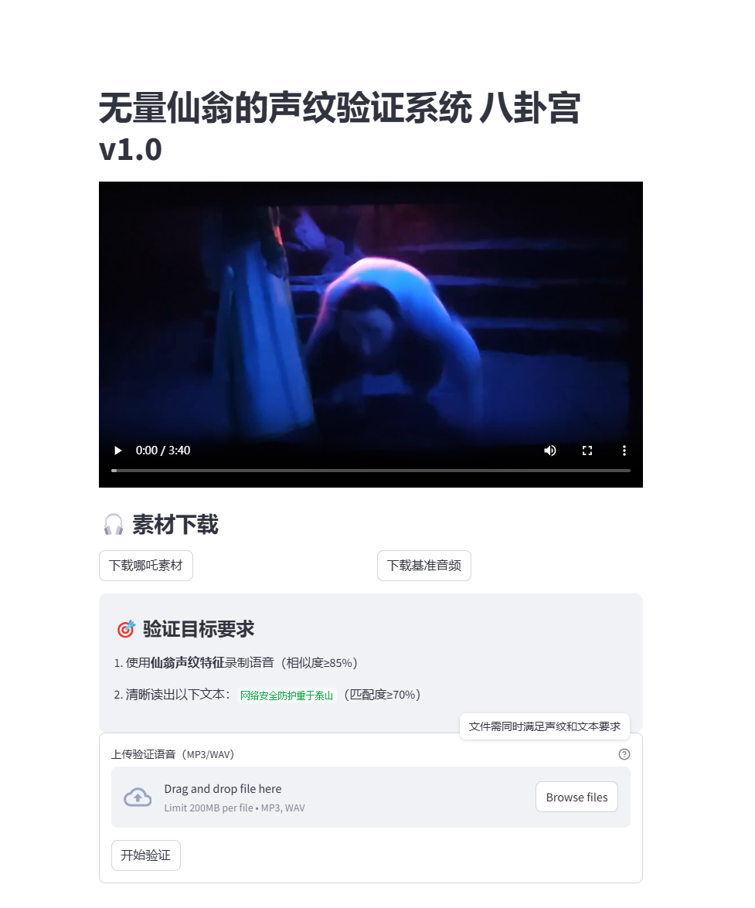

# CTF声纹验证系统

基于声纹识别与语音内容验证的CTF挑战系统，集成视频流播放、声纹特征比对、中文语音转写及拼音对比功能。

## 功能特性
- ​**声音预处理**  
  消除高低频杂音，归一为16k 1channel的音频信息

- 🎤 ​**声纹生物识别**  
  采用ECAPA-TDNN模型提取192维声纹特征，余弦相似度验证
- 📝 ​**语音内容验证**  
  Whisper中文语音识别，使用prompt保证识别结果为普通话，字符级与拼音级双重相似度对比

## 用法
(推荐使用虚拟环境构建)
pip install -r requirements.txt

(可先去test目录对模块进行测试)
streamlit run ./test1_audio_st.py

(第一次启动时要加载模型 速度较慢)
浏览器进入： http://localhost:8501/

